# Agentic Lean Math Assistant

Agentic Lean Math Assistant is a Python 3.12 to 3.14 controller for bounded multi-agent mathematical research and Lean 4 formalization. It freezes each project contract, records execution and evidence, and closes a configured target only after every declared command, claim, formal, and semantic check passes.

<p align="center">
  
</p>

<p align="center"><a href="docs/program-map.html"><strong>Open the standalone HTML Program Map</strong></a></p>

## CMV case study

The canonical project studies the Cañete–Miranda–Vittone strip-density isoperimetry problem. For density 1 on the strip $|y|\le 1$ and density $\lambda>1$ outside it, the current Lean development proves that the checked type-(iv) four-arc family is not minimizing at any admissible density. It constructs an equal-area type-(iii) or constrained-chord competitor with strictly smaller weighted perimeter.

The proved scope has three distinct levels:

| Level | Current result |
|---|---|
| Modeled candidate | Every `FourArcCandidate` satisfying the formal CMV type-(iv) hypotheses is excluded for every $\lambda>1$. |
| Literal source carrier | Every checked four-arc carrier is excluded for every $\lambda>1$, including $h=1$, horizontal translates, almost-everywhere horizontal representatives, and raw closed geometry with source radius $R\ge1$. The latest direct source theorem does not require a contact-law premise. |
| Arbitrary source minimizer | Open. The proof does not derive the required carrier classification from every source-admissible minimizer. |

The main declarations are in:

- [`CMVModeledCutoff.lean`](projects/cmv-strip-density/proof/CMVModeledCutoff.lean), including `candidate_not_isWeightedPerimeterMinimizer` for every $\lambda>1$;
- [`CMVTypeThreeSourceExclusion.lean`](projects/cmv-strip-density/proof/CMVTypeThreeSourceExclusion.lean), including `candidateCarrier_not_isMinimizer` and the contact-law-free raw-carrier exclusions;
- [`CMVSourceClassification.lean`](projects/cmv-strip-density/proof/CMVSourceClassification.lean), which separates closed geometry from density and Snell-law data.

An independent proof path retains the exact cutoff $\lambda\ge51/50$. It composes 1,139 exact-rational cells across $[51/50,9/7]$ and uses a formal cap replacement above $9/7$. That path remains useful as a separate certificate even though the later analytic theorem closes the modeled range for every $\lambda>1$.

### Paper and retained evidence

The paper [A Lean-Verified 51/50 Cutoff and the Remaining-Range Frontier](projects/cmv-strip-density/reports/lean-verified-cmv-frontier.pdf) states the theorem levels, proof architecture, trust boundary, and open classification problem. Its sources are available as [Markdown](projects/cmv-strip-density/reports/lean-verified-cmv-frontier.md) and [standalone HTML](projects/cmv-strip-density/reports/lean-verified-cmv-frontier.html). The PDF freezes its evidence through autorun round 269. The current proof tree and [`projects/cmv-strip-density/README.md`](projects/cmv-strip-density/README.md) are the living scope record for later adjudicated work.

Verification assets include:

- the pinned compiler in `projects/cmv-strip-density/proof/lean-toolchain` and pinned dependencies in `projects/cmv-strip-density/proof/lake-manifest.json`;
- `projects/cmv-strip-density/proof/_Assumptions.lean` and focused `projects/cmv-strip-density/proof/*Assumptions.lean` ledgers;
- exact certificate data and checkers under `projects/cmv-strip-density/proof/compact_fold_gap/`, `projects/cmv-strip-density/proof/middle_face_tiling/`, `projects/cmv-strip-density/proof/exact_germ/`, and `projects/cmv-strip-density/proof/face_bridge_pilot/`;
- retained generator, checker, and mutation receipts beside those certificates;
- controller and publication receipts under the retained campaign and autorun directories.

Run the focused current source exclusion checks from the repository root:

```bash
cd projects/cmv-strip-density/proof
lake build CMVContactLawFreeSourceExclusionSupport
lake env lean CMVFourArcChordVariationAssumptions.lean
lake env lean CMVFourArcRecoveryAssumptions.lean
lake env lean CMVFourArcSourceCompetitorAssumptions.lean
lake env lean CMVTypeThreeSourceExclusionAssumptions.lean
```

Run the full Lean build and permanent axiom ledger:

```bash
cd projects/cmv-strip-density/proof
lake build
lake env lean _Assumptions.lean
```

Run the independent certificate checks:

```bash
cd projects/cmv-strip-density/proof
uv run python verify_certificate.py
uv run python verify_full_domain.py
uv run python verify_calculus.py
python compact_fold_gap/check_compact_certificate.py \
  compact_fold_gap/compact_certificate.json
python compact_fold_gap/run_mutations.py
python exact_germ/exact_germ_checker.py \
  --output exact_germ/independent-check.json
python exact_germ/semantic_audit.py
python face_bridge_pilot/check_bridge.py \
  --output face_bridge_pilot/independent-check.json
python face_bridge_pilot/run_mutations.py
python middle_face_tiling/check_tiling.py \
  middle_face_tiling/manifest.json \
  --output middle_face_tiling/independent-check.json
python middle_face_tiling/run_mutations.py
```

Rebuild the paper with:

```bash
cd projects/cmv-strip-density/reports
./build-lean-verified-cmv-frontier.sh
```

The Markdown, HTML, and PDF explain the result. They are not part of the mathematical trust boundary.

### What remains open

The project does not claim an unconditional proof of CMV Conjecture 3.12. The remaining obligation is geometric and measure-theoretic classification. A full proof must derive bilateral symmetry, common-circle geometry, configuration enumeration, and exact or almost-everywhere carrier identification from every relevant source minimizer. Residual Figure-5 configurations from CMV Lemma 3.8 also remain unresolved. The checked Figure-3, Figure-4, and Figure-5 modules narrow that interface without closing it.

## Quick evaluation

Install the locked environment, inspect the version, validate a self-contained campaign, and run the release smoke test:

```bash
uv sync --locked
uv run agentic-lean-math-assistant --version
uv run agentic-lean-math-assistant validate \
  --campaign examples/claim-ledger/campaign.toml
uv run pytest -q tests/test_release.py
```

The package version is `1.1.1`. Current unreleased work is listed at the top of [`CHANGELOG.md`](CHANGELOG.md).

## Install

Requirements:

- Linux with `os.pidfd_open`, a working `systemd --user` manager, and Bubblewrap;
- Python 3.12, 3.13, or 3.14;
- [`uv`](https://docs.astral.sh/uv/);
- OMP on `PATH`, or an explicit `--omp` path;
- Herdr on `PATH`, or an explicit `--herdr` path;
- Lean and Lake for formal-proof stages.

Install the locked base environment:

```bash
uv sync --locked
```

Install notebook and scientific packages when a project needs them:

```bash
uv sync --locked --extra research
```

Install the optional regression backend with:

```bash
uv sync --locked --extra ml
```

TensorFlow is selected only on supported Python versions. The linear regression workflow remains available without it.

## Program model

The engine is problem-agnostic. A project manifest supplies the problem, frozen inputs, tools, model routes, budgets, source policy, containment policy, and exact success contract. The CMV project is one demanding instance of that engine; its geometry is not built into the controller.

The controller distinguishes three records:

1. **Execution state** records which stages ran, failed, retried, resumed, or were invalidated.
2. **Evidence state** records immutable inputs, prompts, commands, outputs, receipts, digests, reports, and limitations.
3. **Truth state** records exact claims, dependency edges, verifier decisions, Lean declarations, semantic findings, and target closure.

A successful process can add evidence. It cannot by itself change truth state.

## Fixed research regime

`regime-run` implements a fixed research, plan, execute, assess cycle:

1. A research gate decides whether new publication work is needed.
2. Publication research records accessible sources and names critical inaccessible sources.
3. The operator either supplies a missing critical source, records an explicit waiver, or leaves the run checkpointed.
4. The planner emits a schema-v3 strategy DAG with obligations, falsification tests, evidence requirements, reasoning classes, capability choices, budgets, and failure policy.
5. The controller validates the plan before any campaign stage runs. Invalid plans receive bounded repair attempts.
6. Capped pilot tasks run before expensive descendants. Audit continuation gates can stop those descendants.
7. Ready stages execute against the retained workspace with bounded attempts and novelty checks on retries.
8. The main assessment disposes every frozen obligation and reports solved, unsolved, or blocked. The controller records compute use and any allowed successor choices.

Interactive use asks for the inaccessible-source policy before starting agents:

```bash
uv run agentic-lean-math-assistant regime-run \
  --project projects/cmv-strip-density/project.toml
```

Non-interactive use must state the policy:

```bash
uv run agentic-lean-math-assistant regime-run \
  --project projects/cmv-strip-density/project.toml \
  --missing-source-policy checkpoint \
  --headless
```

Use `--missing-source-policy continue` only when retaining the source limitation is acceptable.

### Agent roles

Model names and budgets come from each project manifest. The current CMV manifest routes work as follows:

- **Sol** plans campaigns, performs invention work, writes the main assessment, and serves as the autorun conductor.
- **Luna** handles mechanical execution work.
- **Terra** performs established analysis, audit, and independent autorun progress adjudication.
- **Astra** reviews autorun strategy. A campaign may also use Astra for a targeted task only when the manifest quota allows it and the plan ties it to retained evidence of a primary-model failure.

These are alternative reasoning routes, not a chain in which every agent handles every task. Agents propose plans and artifacts. The controller validates plans, owns state changes, enforces limits, and decides whether configured gates have passed.

## Claims and target closure

A campaign can declare exact targets in TOML and use a `claim_ledger` stage to close them. The proposer emits a strict `claim-proposals-v1` handoff. Separately scheduled verifiers emit complete `claim-verdicts-v1` handoffs.

The controller rejects malformed IDs, unknown dependencies, cycles, duplicate targets, incomplete verdict sets, and acceptance verdicts that report critical errors or gaps. It blocks descendants of rejected premises. Claim IDs are content hashes over the exact statement, scope, proof, limitations, target, campaign, and predecessor IDs, so changing a premise changes its descendants.

Target closure can also require replayable command receipts that name the targets and frozen inputs they cover. The controller re-digests those inputs at closure and replay. A verifier must decide every proposed claim, and every configured verifier must accept before the target closes. An optional independent adjudicator can resolve retained verifier disagreement.

Run the minimal claim-ledger example:

```bash
uv run agentic-lean-math-assistant validate \
  --campaign examples/claim-ledger/campaign.toml
uv run agentic-lean-math-assistant run \
  --campaign examples/claim-ledger/campaign.toml
uv run agentic-lean-math-assistant claims \
  --run examples/claim-ledger/runs/<run-id>
```

The final command prints the content-addressed claims, verdicts, evidence references, and required-target status.

## Lean and semantic boundaries

A `lean_contract` stage compiles the formal contract from the immutable input snapshot. The controller then loads the compiled module through its own Lean helper, checks each configured declaration at the exact expected type, calls `Lean.collectAxioms`, and enforces the allowed axiom set. It does not trust mutable workspace text or parse a model-written axiom report.

A separate `semantic_contract` reviewer compares the informal and formal statements. Its strict record covers hypotheses, quantifiers, domains, symbols, branches, degeneracies, and boundary cases. A report of equivalence cannot contain a hidden added hypothesis or unresolved mismatch.

These gates answer different questions:

- Did the Lean kernel accept the exact declaration under the allowed axioms?
- Does that declaration express the theorem in the project contract?

Compilation answers only the first question. A model claim answers neither. Both checks must pass when the project configures both.

## Execution containment

Generic campaigns default to a fail-closed Linux sandbox. Bubblewrap gives each stage private mount, PID, and network namespaces. The retained workspace is the writable host path; home, `/tmp`, and `/run` are private. Outbound networking is disabled by default. A transient user-systemd cgroup enforces time, memory, swap, CPU, task-count, and file-size limits.

The manifest controls environment names, executable paths, network access, workspace size, and whether generated workspace binaries may run. Secret environment values are forbidden for sandboxed untrusted stages because arbitrary code could encode them into retained artifacts. Receipts fingerprint the effective non-secret environment, executable bytes, dependency manifests, and sandbox policy.

Sandbox creation has no automatic unsandboxed fallback. A manifest may set `sandbox = false` only as an explicit trust decision. Namespace isolation then disappears, but cgroup resource limits still apply and the receipt records the choice. The CMV manifest uses this trusted mode so OMP can access the operator's existing login. Do not use that manifest for untrusted prompts or inputs.

## Bounded campaign autonomy

`autonomy-run` executes successive fixed-regime campaigns under a project-specific success contract:

```bash
uv run agentic-lean-math-assistant autonomy-run \
  --project projects/cmv-strip-density/project.toml \
  --headless
```

The manifest caps campaign count, elapsed time, consecutive failures, and analysis time. Between campaigns, a read-only optimizer receives the original problem, retained outcome, limitations, evidence gaps, compute ledger, and exact success contract. Its successor directive cannot change the problem or success hash.

A campaign's `solved` report is still only a claim. Before autonomous success, the controller rechecks the evidence index, required artifacts, build command, exact theorem types, axiom reports, and every configured verification command. Exhausted time, campaign, or failure budgets produce a retained checkpoint or `budget_exhausted` state rather than success.

Unless AFK selection is enabled, the controller waits for an operator decision before a successor campaign. Inspect and control a session with:

```bash
uv run agentic-lean-math-assistant autonomy-status \
  --session projects/cmv-strip-density/autonomy-runs/<session-id>
uv run agentic-lean-math-assistant autonomy-decide \
  --session projects/cmv-strip-density/autonomy-runs/<session-id> \
  --strategy <strategy-id|recommended|stop>
uv run agentic-lean-math-assistant autonomy-resume \
  --project projects/cmv-strip-density/project.toml \
  --session projects/cmv-strip-density/autonomy-runs/<session-id> \
  --headless
```

## Persistent autorun

`autorun` is the unattended project conductor. It reloads `MASTER_PROMPT.md` before every round and retains the prompt, output, receipt, trusted metrics, strategy contract, independent adjudication, and controller event under `autorun-runs/<session>/`.

Astra reviews strategy without editing the project. Sol executes each validated round with the project's allowed tools. Terra independently judges observable progress. The controller accepts only strict, current-revision protocol records and is the only component that mutates retained strategy or progress state.

The first execution waits for a valid strategy. Soft reviews and checkpoints request another strategy decision but do not falsify work or reset hard ceilings. Continuation preserves the strategy ID, lineage start, and hard deadline. A course change archives the old contract and starts a new lineage. Invalid, stale, wrong-order, or incomplete output receives no progress credit.

The default conductor round limit is 90 minutes. Strategy health reviews occur on the configured 120 to 240 minute interval, repeated output, or repeated execution failure. Failures use bounded backoff and remain on the Sol conductor route. They never reroute execution to Astra. The manifest may cap each lineage at 1 to 100 successful executions and may add trusted progress-metric commands.

Start autorun with either console entry point:

```bash
uv run autorun \
  --project projects/cmv-strip-density/project.toml

uv run agentic-lean-math-assistant autorun \
  --project projects/cmv-strip-density/project.toml \
  --reflection-round-minutes 15
```

An interrupted controller resumes the active retained session. Edit `MASTER_PROMPT.md` while it runs; the next round reads the new contents.

Use the live status, output, and event followers or request a durable stop:

```bash
uv run agentic-lean-math-assistant autorun-status \
  --session projects/cmv-strip-density/autorun-runs/<session-id> \
  --follow --interval 1 --recap-minutes 10
uv run agentic-lean-math-assistant autorun-output \
  --session projects/cmv-strip-density/autorun-runs/<session-id> \
  --interval 1
uv run agentic-lean-math-assistant autorun-events \
  --session projects/cmv-strip-density/autorun-runs/<session-id> \
  --interval 1
uv run agentic-lean-math-assistant autorun-stop \
  --session projects/cmv-strip-density/autorun-runs/<session-id>
```

The followers reread `state.json`, follow the active round, and reconnect across stop and resume cycles. Status shows the validated strategy contract, independent progress counts, retry time, current objective, and critical-path recap. Agent stdout is never used as controller state.

## Resume and recovery

When a regime run waits for a publication, add the source to the project's `references/` directory and resume:

```bash
uv run agentic-lean-math-assistant regime-resume \
  --project projects/cmv-strip-density/project.toml \
  --run projects/cmv-strip-density/runs/<run-id>
```

To continue while retaining the missing-source limitation:

```bash
uv run agentic-lean-math-assistant regime-resume \
  --project projects/cmv-strip-density/project.toml \
  --run projects/cmv-strip-density/runs/<run-id> \
  --waive-missing-sources
```

After an unresolved campaign, record a retained successor choice:

```bash
uv run agentic-lean-math-assistant choose-strategy \
  --run projects/cmv-strip-density/runs/<run-id> \
  --strategy <strategy-id|stop>
```

Generic campaign runs can retry failed stages or one named stage:

```bash
uv run agentic-lean-math-assistant resume \
  --run path/to/runs/<run-id> \
  --retry-stage <stage-id> \
  --feedback "Use the retained failure evidence."
```

Each campaign and pre-campaign phase keeps an append-only `events.jsonl` journal with monotonic sequence numbers and SHA-256 links. `state.json` is an atomic projection, not the recovery authority. Before a stage attempt, the runtime checkpoints the retained workspace. After controller death it terminates registered stale processes, restores interrupted attempts, records the interruption, and applies the configured retry policy. Evidence verification rejects edits, deletions, reordering, omitted files, and unexpected retained files.

## Inspect, verify, replay, and publish

Use the read-only inspection commands on a retained campaign:

```bash
uv run agentic-lean-math-assistant status --run path/to/runs/<run-id>
uv run agentic-lean-math-assistant dashboard --watch --run path/to/runs/<run-id>
uv run agentic-lean-math-assistant claims --run path/to/runs/<run-id>
uv run agentic-lean-math-assistant audit --run path/to/runs/<run-id>
uv run agentic-lean-math-assistant verify --run path/to/runs/<run-id>
```

`audit` reports execution, evidence integrity, formal verification, semantic assurance, claim closure, obligation coverage, and unresolved limitations as separate fields. It does not turn agent prose into proof.

A stage marked `replayable = true` can rerun its frozen command without a shell or caller-supplied arguments:

```bash
uv run agentic-lean-math-assistant replay \
  --run path/to/runs/<run-id> \
  --stage <allowlisted-command-stage>
```

Replay rejects changed evidence inputs, environment, executable bytes, dependency manifests, or containment policy. The new receipt joins the evidence index.

Publication uses two explicit steps:

```bash
uv run agentic-lean-math-assistant publish-plan \
  --run path/to/runs/<run-id>
uv run agentic-lean-math-assistant publish \
  --run path/to/runs/<run-id> \
  --approve-digest <sha256>
```

The first command reports every added, changed, deleted, and preserved path and hashes the plan. The second rechecks the source and destination, applies only that digest, verifies the result, and retains a publication receipt. Interrupted publication is rolled back before a new plan is accepted.

Use `uv run agentic-lean-math-assistant stop-all` to close every registered campaign process and retained Herdr workspace.

## Numeric regression capability

Regression is an optional research aid, not proof. Assessment and fitting are separate commands:

```bash
uv run agentic-lean-math-assistant regression-assess \
  --features retained/features.npy \
  --targets retained/targets.npy \
  --output retained/regression-assessment.json

uv run agentic-lean-math-assistant regression-fit \
  --features retained/features.npy \
  --targets retained/targets.npy \
  --config retained/regression.json \
  --output retained/regression-fit
```

The loader accepts Python lists and `.npy`, `.npz`, `.csv`, `.tsv`, or nested-array `.json` files. A strict JSON or TOML config selects linear regression or a bounded TensorFlow dense model. Fitting uses a held-out split, train-only normalization, an ordinary least-squares baseline, retained hashes, per-target metrics, and explicit `proof_status = "not_proof"`. The planner must explicitly use or skip assessment and fitting; numeric files do not silently trigger training.

## Blind autonomy benchmarks

Benchmark expectations live in a suite manifest outside each agent snapshot:

```bash
uv run python benchmarks/autonomy-calibration/validation/validate_cases.py
uv run agentic-lean-math-assistant benchmark \
  --suite benchmarks/autonomy-calibration/benchmark.toml \
  --headless
```

The included calibration suite has 12 cases: four exact derivations, three Lean repairs, three underdetermined tasks, and two false-closure traps. The report records expected and observed outcomes, false closures, case errors, run paths, compute ledgers, and manifest digests. One failed case does not prevent later cases from running. Acceptance requires every expected outcome to match with no false closure or case error.

Resume an interrupted schema-v2 report with:

```bash
uv run agentic-lean-math-assistant benchmark \
  --resume path/to/benchmark-report.json \
  --headless
```

Resume verifies the suite snapshot, completed prefix, scoring, report directory, and completed project-manifest digests before running the first unfinished case. The hosted-agent calibration manifests set `execution.sandbox = false` so OMP can use an existing login. Run only the trusted repository cases in that mode.

## Repository layout

```text
docs/
  program-map.html                 standalone accessible architecture map
  program-map.svg                  README program map
src/agentic_lean_math_assistant/   orchestration package
  claims.py                        claim contracts and target closure
  lean.py                          exact declaration and axiom checks
  semantic.py                      informal-to-formal review contract
  inspection.py                    retained assurance inspection
  regime.py                        fixed research regime
  autonomy.py                      bounded multi-campaign controller
  autorun.py                       persistent strategy and execution loop
  sandbox.py                       Bubblewrap and cgroup containment
  publication.py                   digest-approved publication
  regression.py                    optional numeric assessment and fitting
examples/claim-ledger/             minimal verifier-gated campaign
projects/cmv-strip-density/
  project.toml                     CMV models, budgets, inputs, and success policy
  problem.md                       canonical mathematical contract
  MASTER_PROMPT.md                 living autorun contract
  references/                      frozen source material
  knowledge/                       promoted research state
  proof/                           canonical Lean project and certificates
  reports/                         Markdown, HTML, PDF, and build scripts
  runs/                            selected campaign evidence
benchmarks/autonomy-calibration/   12-case blind outcome suite
scripts/                           release and verification utilities
tests/                             unit, property, failure-path, and end-to-end tests
CHANGELOG.md                       released and unreleased changes
V2_BUILD_PLAN.md                   unimplemented native-v2 roadmap
```

New raw campaign runs, generated caches, and duplicate proof trees are ignored. Selected campaign and benchmark evidence remains in the repository when it supports audit or replay.

## Development checks

Run the same package checks used by CI:

```bash
uv lock --check
uv run ruff format --check src tests scripts benchmarks/cmv-range-reduction/validation
uv run ruff check src tests scripts benchmarks/cmv-range-reduction/validation
uv run mypy src scripts benchmarks/cmv-range-reduction/validation/validate_result.py
uv run pytest -q
uv build
```

CI qualifies Python 3.12, 3.13, and 3.14, smoke-tests the installed wheel, builds the retained Lean project, validates the blind benchmark certificates, and runs the independent CMV certificate checkers.

## Release, roadmap, and license

The current package release is `1.1.1`. Build and verify a candidate from a completed one-shot proof campaign with:

```bash
uv run python scripts/build_release.py \
  --proof-run projects/cmv-strip-density/one-shot/runs/<run-id>
uv run python scripts/verify_release.py \
  --candidate dist/agentic-lean-math-assistant-1.1.1
```

The builder verifies the retained evidence, package metadata, bounded source distribution, proof archive, required PDFs, manifest, and checksums. It does not create a tag, push a branch, or publish externally.

[`V2_BUILD_PLAN.md`](V2_BUILD_PLAN.md) describes a substantially different native control plane. Its implementation has not started, and it is not part of this release. The v1 Python controller documented here remains the shipped system.

This repository is a proprietary portfolio release. Copyright © 2026 Rosa Pavlak. Viewing the repository and running the documented verification commands for personal evaluation, educational review, or employment assessment is permitted. No license is granted to use, copy, modify, distribute, sublicense, or sell the software, proofs, reports, or other materials. See [`LICENSE`](LICENSE) for the exact terms.